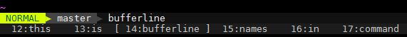

# vim-bufferline

Super simple vim plugin to show the list of buffers in the command bar.

# demo



# integration with statusline

by default this plugin will print out the list of buffers into the command bar, however it can be configured to take space in the status line instead.  for example:

```
let g:bufferline_echo=0
set statusline=%{bufferline#generate_string()}
```

# credits

This was inspired by the [buftabs](http://www.vim.org/scripts/script.php?script_id=1664) script.

# license

`:help license`
